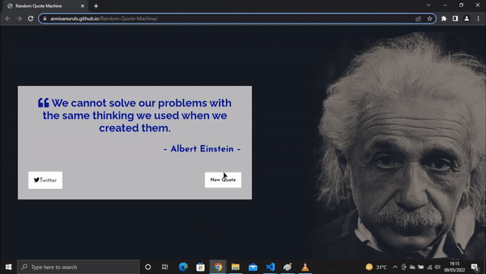
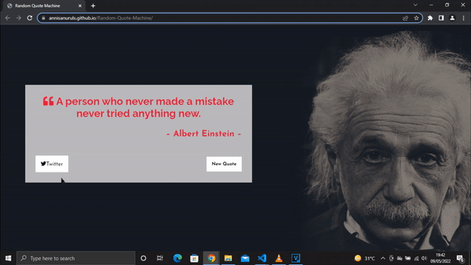

# Random-Quote-Machine
FreeCodeCamp Front End Development Libraries Projects - <a href="https://www.freecodecamp.org/learn/front-end-development-libraries/front-end-development-libraries-projects/build-a-random-quote-machine">Build a Random Quote Machine</a> 
this project was created using : 
<ul>
  <li background-color="purple">HTML</li>
  <li>CSS</li>
  <li>JavaScript (JQuery)</li>
</ul>
 

  

## show different quote with the author picture

  

## Draggable Quote Box

  

## Posting Quote in Twitter

  

 

## And Other Things
### <li><a href="https://gist.githubusercontent.com/annisanuruls/4bbaec23893368fde783689d90ad297f/raw/5ee2a90f31a8aa4307c28e599d7caee33a3016eb/quotes_and_img.json">Quote List</a></li>

### <li><a href="https://codepen.io/Owl_20400/full/YzYdzKx">CodePen Submit Link for FreeCodeCamp</a></li>
